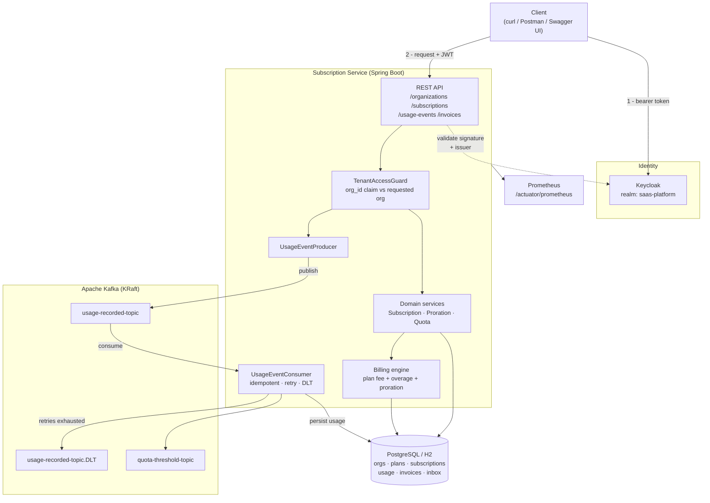
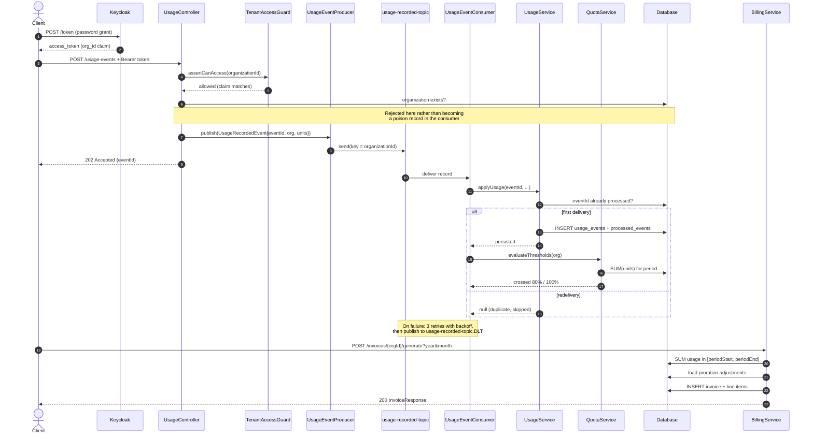
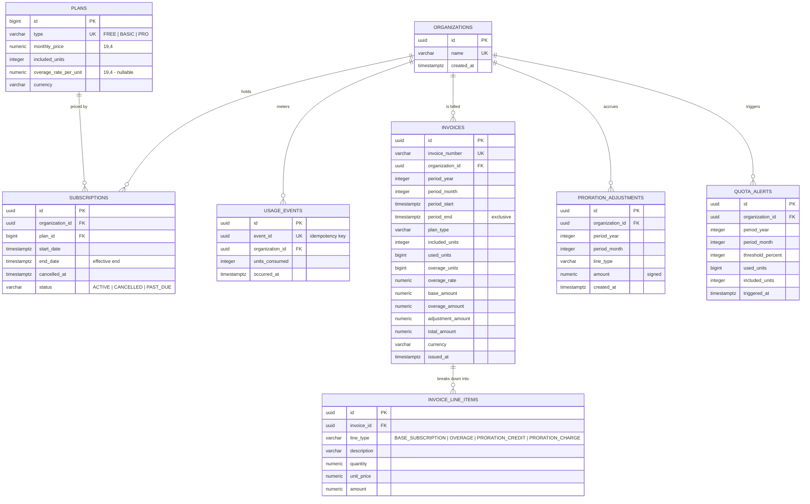

# Subscription & Billing Platform

[](https://github.com/vivek/subscription-billing-platform/actions/workflows/ci.yml)
[](https://openjdk.org/projects/jdk/17/)
[](https://spring.io/projects/spring-boot)
[](https://kafka.apache.org/)
[](https://www.postgresql.org/)
[](LICENSE)

A multi-tenant SaaS backend for **subscription management and usage-based billing**. Tenants
subscribe to a plan, report metered usage through an asynchronous Kafka pipeline, and are
invoiced for their plan fee plus any overage beyond the plan allowance.

It is built as a realistic service rather than a demo: money is `BigDecimal` end to end,
invoices are persisted and immutable, Kafka consumption is idempotent with retry and a
dead-letter topic, tenant isolation is enforced against the caller's token, and the schema is
owned by Flyway migrations.

---

## Table of contents

- [Features](#features)
- [Architecture](#architecture)
- [Domain model](#domain-model)
- [Tech stack](#tech-stack)
- [Getting started](#getting-started)
- [API reference](#api-reference)
- [Worked end-to-end example](#worked-end-to-end-example)
- [Billing model](#billing-model)
- [Multi-tenant isolation](#multi-tenant-isolation)
- [Configuration](#configuration)
- [Testing](#testing)
- [Project structure](#project-structure)
- [Screenshots](#screenshots)
- [Roadmap](#roadmap)
- [Contributing](#contributing)
- [License](#license)

---

## Features

### Tenancy & security

- Organizations as first-class tenants, provisioned by a platform admin.
- OAuth2 resource server validating Keycloak-issued JWTs.
- **Tenant isolation enforced on every organization-scoped endpoint**: the organization id in
  the request is checked against the caller's `org_id` / `org_ids` token claims. A token with
  neither claim and no `PLATFORM_ADMIN` role reaches nothing — deny by default.
- Keycloak realm roles mapped to Spring Security authorities.
- RFC 7807 problem responses from a single `@RestControllerAdvice`.

### Subscriptions

- Subscribe an organization to a `FREE`, `BASIC` or `PRO` plan.
- Upgrade or downgrade mid-cycle with **day-based proration** — the unused remainder of the old
  plan is credited and the matching remainder of the new plan is charged.
- Cancel with an effective date, defaulting to the end of the paid period.
- Lifecycle modelled as `ACTIVE` / `CANCELLED` / `PAST_DUE`, with the full subscription history
  retained for audit.

### Usage & billing

- Usage reported over HTTP, published to Kafka, consumed and applied asynchronously.
- **Persisted invoices** with an immutable invoice number and a line-item breakdown
  (plan fee, overage, proration credits and charges).
- Invoice generation is **idempotent** per organization and period — a closed period always
  reports the same figures.
- All monetary values are `BigDecimal`, rounded `HALF_UP` to two decimal places.
- Overage rates configurable per plan, with a platform-wide fallback.

### Event pipeline

- `usage-recorded-topic` partitioned by organization, so a tenant's usage is consumed in order.
- **Idempotent consumption**: each event carries an `eventId` recorded in an inbox table, so a
  Kafka redelivery is dropped instead of double-billing the tenant.
- Bounded retry with exponential backoff, then **dead-lettering** to
  `usage-recorded-topic.DLT` so one poison record cannot block a partition.
- Malformed payloads are dead-lettered rather than killing the consumer thread.

### Quota & observability

- Usage tracked against the plan allowance, with alerts emitted to `quota-threshold-topic` the
  first time a tenant crosses 80% and 100% of it (each threshold fires once per period).
- Live quota endpoint showing consumption, remaining units and accrued overage.
- Micrometer metrics on a Prometheus endpoint, including custom counters for usage events
  consumed, duplicates skipped, invoices generated and cumulative revenue.

### Platform

- Flyway-managed schema, identical migration on H2 and PostgreSQL.
- Profiles: `dev` (in-memory H2) and `prod` (PostgreSQL).
- OpenAPI 3 with Swagger UI.
- Multi-stage Dockerfile producing a non-root JRE image with a healthcheck.
- One-command local stack: app + Kafka + Keycloak + PostgreSQL.

---

## Architecture



### Asynchronous usage recording and invoicing



---

## Domain model



Two supporting tables carry no foreign keys: `processed_events` (the consumer inbox that makes
redelivery a no-op) and `flyway_schema_history`.

---

## Tech stack

| Layer | Technology | Version |
| --- | --- | --- |
| Language | Java | 17 |
| Framework | Spring Boot | 3.5.11 |
| Web | Spring MVC | 6.2.x (via Boot) |
| Security | Spring Security, OAuth2 Resource Server | 6.5.8 |
| Identity provider | Keycloak | 25.0 |
| Persistence | Spring Data JPA / Hibernate ORM | 6.6.42.Final |
| Migrations | Flyway | 11.7.2 |
| Database (prod) | PostgreSQL / JDBC driver | 16 / 42.7.10 |
| Database (dev, test) | H2 in-memory | 2.3.232 |
| Messaging | Apache Kafka (KRaft) / Spring for Apache Kafka | 3.9.1 / 3.3.13 |
| API docs | springdoc-openapi | 2.8.9 |
| Metrics | Micrometer + Prometheus registry | 1.15.9 |
| Testing | JUnit 5 / Mockito / AssertJ / Awaitility | 5.12.2 / 5.17.0 / 3.27.7 / 4.2.2 |
| Test broker | spring-kafka-test `@EmbeddedKafka` | 3.3.13 |
| Build | Maven (wrapper included) | 3.9.x |
| Container | Docker multi-stage, non-root JRE | — |

---

## Getting started

### Prerequisites

| Tool | Needed for | Notes |
| --- | --- | --- |
| JDK 17 | building and running the service | `java -version` should report 17 |
| Docker + Compose v2 | the full local stack | only for `docker compose`; not needed to build or test |
| `curl` and `jq` | the examples below | `jq` is optional, it just formats output |

Maven is **not** required — the repository ships the Maven wrapper (`./mvnw`).

### Option A — run everything with Docker

Brings up PostgreSQL, Kafka (KRaft, no ZooKeeper), Keycloak with the realm pre-imported, and
the service itself. All four have healthchecks, and the service waits for the other three.

```bash
git clone https://github.com/vivek/subscription-billing-platform.git
cd subscription-billing-platform

cp .env.example .env      # optional: every value already has a working default
docker compose up -d --build

# Watch until all four report healthy
docker compose ps
```

| Service | URL |
| --- | --- |
| Subscription service | <http://localhost:8080> |
| Swagger UI | <http://localhost:8080/swagger-ui.html> |
| Health | <http://localhost:8080/actuator/health> |
| Prometheus metrics | <http://localhost:8080/actuator/prometheus> |
| Keycloak console | <http://localhost:8081> (`admin` / `admin`) |
| Kafka bootstrap | `localhost:9092` |
| PostgreSQL | `localhost:5432` (`subscription` / `subscription`) |

Tear down with `docker compose down`, or `docker compose down -v` to drop the volumes too.

### Option B — run the service locally against in-memory H2

No Docker, no Kafka, no Keycloak. Useful for working on the domain logic.

```bash
./mvnw spring-boot:run -Dspring-boot.run.profiles=dev
```

The `dev` profile uses H2 in memory (JDBC URL `jdbc:h2:mem:subdb`, user `sa`, no password) and
Flyway applies the same migration it applies to PostgreSQL.

With no broker running, the service still starts and every synchronous endpoint works — only
`POST /usage-events`, which publishes to Kafka, has nowhere to send its message. Startup takes
about a minute in that state, because the Kafka admin client spends roughly 40 seconds trying to
provision its topics before giving up with `Could not configure topics` and continuing. The
warnings are expected; the service is healthy once `Started SubscriptionServiceApplication`
appears.

To point a locally-run service at the Dockerised infrastructure:

```bash
KAFKA_BOOTSTRAP_SERVERS=localhost:9092 \
KEYCLOAK_ISSUER_URI=http://localhost:8081/realms/saas-platform \
./mvnw spring-boot:run -Dspring-boot.run.profiles=dev
```

### Keycloak realm and getting a token

`infra/keycloak/realm-export.json` is imported automatically on first start. It creates:

| Item | Value |
| --- | --- |
| Realm | `saas-platform` |
| Client | `subscription-api` (public, direct access grants enabled) |
| Realm roles | `PLATFORM_ADMIN`, `TENANT_USER` |
| Claim mappers | `org_id` (single), `org_ids` (multi-valued) |
| Admin user | `platform-admin` / `admin123` — holds `PLATFORM_ADMIN` |
| Tenant user | `acme-user` / `acme123` — holds `TENANT_USER` + an `org_id` attribute |
| Second tenant | `globex-user` / `globex123` — a different `org_id`, for proving isolation |

Fetch an access token with the password grant:

```bash
TOKEN=$(curl -s -X POST \
  "http://localhost:8081/realms/saas-platform/protocol/openid-connect/token" \
  -d "grant_type=password" \
  -d "client_id=subscription-api" \
  -d "username=platform-admin" \
  -d "password=admin123" | jq -r .access_token)

echo "${TOKEN:0:40}..."
```

Pass it on every call as `-H "Authorization: Bearer $TOKEN"`.

> **Linking a tenant user to an organization.** Organization ids are generated at runtime, so
> the two tenant users ship with placeholder `org_id` attributes. After creating an
> organization, set the real id on the user — Keycloak console → *saas-platform* → *Users* →
> *acme-user* → *Attributes* → set `org_id` to the organization's UUID → *Save*, then request a
> fresh token. Until you do, `acme-user` is correctly denied access to it, which is the
> isolation rule working as intended.

### Building

```bash
./mvnw -B clean verify          # compile, run the full test suite, package
./mvnw -B -DskipTests package   # jar only, at target/subscription-service-0.0.1-SNAPSHOT.jar
```

---

## API reference

Base URL `http://localhost:8080`. Every endpoint below except the public ones requires
`Authorization: Bearer <token>`.

| Method | Path | Auth | Description |
| --- | --- | --- | --- |
| `POST` | `/organizations` | `PLATFORM_ADMIN` | Provision a tenant organization |
| `GET` | `/organizations/{orgId}` | tenant member | Fetch an organization |
| `GET` | `/organizations/{orgId}/quota` | tenant member | Usage against the plan allowance |
| `POST` | `/subscriptions` | tenant member | Subscribe an organization to a plan |
| `GET` | `/subscriptions/{orgId}` | tenant member | Current subscription |
| `GET` | `/subscriptions/{orgId}/history` | tenant member | Every subscription ever held |
| `POST` | `/subscriptions/{orgId}/change-plan` | tenant member | Upgrade or downgrade, prorated |
| `POST` | `/subscriptions/{orgId}/cancel` | tenant member | Cancel, optionally at a future date |
| `POST` | `/usage-events` | tenant member | Report metered usage (async) |
| `POST` | `/invoices/{orgId}/generate` | tenant member | Generate or fetch a period's invoice |
| `GET` | `/invoices/{orgId}` | tenant member | List issued invoices |
| `GET` | `/invoices/{orgId}/{invoiceNumber}` | tenant member | Fetch one invoice |
| `GET` | `/swagger-ui.html` | public | Swagger UI |
| `GET` | `/v3/api-docs` | public | OpenAPI 3 document |
| `GET` | `/actuator/health` | public | Liveness / readiness |
| `GET` | `/actuator/prometheus` | public | Prometheus scrape endpoint |
| `GET` | `/actuator/metrics` | authenticated | Micrometer metric names and values |

"tenant member" means the caller's token must claim the organization via `org_id` or `org_ids`;
a `PLATFORM_ADMIN` token satisfies every tenant check.

### `POST /organizations`

```bash
curl -X POST http://localhost:8080/organizations \
  -H "Authorization: Bearer $TOKEN" \
  -H "Content-Type: application/json" \
  -d '{"name":"Acme Corp"}'
```

`201 Created`

```json
{
  "id": "3fa85f64-5717-4562-b3fc-2c963f66afa6",
  "name": "Acme Corp",
  "createdAt": "2026-02-01T09:14:22.481Z"
}
```

### `POST /subscriptions`

```bash
curl -X POST http://localhost:8080/subscriptions \
  -H "Authorization: Bearer $TOKEN" \
  -H "Content-Type: application/json" \
  -d '{"organizationId":"3fa85f64-5717-4562-b3fc-2c963f66afa6","planType":"BASIC"}'
```

`201 Created`

```json
{
  "id": "8c0a1f2e-9b47-4a1d-8f52-2b6c9a0d1e33",
  "organizationId": "3fa85f64-5717-4562-b3fc-2c963f66afa6",
  "planType": "BASIC",
  "monthlyPrice": 499.0000,
  "includedUnits": 10000,
  "currency": "USD",
  "status": "ACTIVE",
  "startDate": "2026-02-01T09:15:03.117Z",
  "endDate": null,
  "cancelledAt": null
}
```

### `GET /subscriptions/{orgId}`

```bash
curl -H "Authorization: Bearer $TOKEN" \
  http://localhost:8080/subscriptions/3fa85f64-5717-4562-b3fc-2c963f66afa6
```

Returns the same shape as above. `409 Conflict` if the organization has no current subscription.

### `GET /subscriptions/{orgId}/history`

Returns an array of subscriptions, newest first — including `CANCELLED` rows left behind by
plan changes, so the tenant's history is auditable.

### `POST /subscriptions/{orgId}/change-plan`

```bash
curl -X POST \
  http://localhost:8080/subscriptions/3fa85f64-5717-4562-b3fc-2c963f66afa6/change-plan \
  -H "Authorization: Bearer $TOKEN" \
  -H "Content-Type: application/json" \
  -d '{"planType":"PRO"}'
```

`200 OK` — the credit and charge are parked on the current period and appear on its invoice.

```json
{
  "subscription": {
    "id": "b41d77e0-1c8a-4a1e-9f0c-77b2d5e1a904",
    "organizationId": "3fa85f64-5717-4562-b3fc-2c963f66afa6",
    "planType": "PRO",
    "monthlyPrice": 1999.0000,
    "includedUnits": 100000,
    "currency": "USD",
    "status": "ACTIVE",
    "startDate": "2026-04-16T12:00:00Z",
    "endDate": null,
    "cancelledAt": null
  },
  "prorationCredit": 249.50,
  "prorationCharge": 999.50,
  "netAdjustment": 750.00,
  "remainingDaysInPeriod": 15,
  "daysInPeriod": 30,
  "appliedToPeriod": "2026-04"
}
```

### `POST /subscriptions/{orgId}/cancel`

```bash
# Cancel at the end of the current billing period (default)
curl -X POST \
  http://localhost:8080/subscriptions/3fa85f64-5717-4562-b3fc-2c963f66afa6/cancel \
  -H "Authorization: Bearer $TOKEN"

# Or cancel at a specific instant
curl -X POST \
  http://localhost:8080/subscriptions/3fa85f64-5717-4562-b3fc-2c963f66afa6/cancel \
  -H "Authorization: Bearer $TOKEN" \
  -H "Content-Type: application/json" \
  -d '{"effectiveAt":"2026-03-01T00:00:00Z"}'
```

`200 OK` with `"status": "CANCELLED"` and `endDate` set to the effective date.

### `POST /usage-events`

```bash
curl -X POST http://localhost:8080/usage-events \
  -H "Authorization: Bearer $TOKEN" \
  -H "Content-Type: application/json" \
  -d '{"organizationId":"3fa85f64-5717-4562-b3fc-2c963f66afa6","unitsConsumed":2500}'
```

`202 Accepted` — the event is published to Kafka and applied asynchronously. The returned
`eventId` is the idempotency key the consumer dedupes on.

```json
{
  "eventId": "0f9a2c31-45de-4b77-8c02-6d1e5a9b3f70",
  "organizationId": "3fa85f64-5717-4562-b3fc-2c963f66afa6",
  "unitsConsumed": 2500,
  "occurredAt": "2026-02-14T10:22:41.903Z",
  "topic": "usage-recorded-topic"
}
```

### `GET /organizations/{orgId}/quota`

```bash
curl -H "Authorization: Bearer $TOKEN" \
  "http://localhost:8080/organizations/3fa85f64-5717-4562-b3fc-2c963f66afa6/quota?year=2026&month=2"
```

`year` and `month` are optional and default to the current UTC month.

```json
{
  "organizationId": "3fa85f64-5717-4562-b3fc-2c963f66afa6",
  "planType": "BASIC",
  "periodYear": 2026,
  "periodMonth": 2,
  "usedUnits": 12500,
  "includedUnits": 10000,
  "remainingUnits": 0,
  "usagePercent": 125.00,
  "overQuota": true,
  "projectedOverageAmount": 250.00,
  "currency": "USD",
  "thresholdsCrossed": [80, 100]
}
```

### `POST /invoices/{orgId}/generate`

```bash
curl -X POST \
  "http://localhost:8080/invoices/3fa85f64-5717-4562-b3fc-2c963f66afa6/generate?year=2026&month=2" \
  -H "Authorization: Bearer $TOKEN"
```

`200 OK`. Idempotent: calling it again for the same period returns the invoice already on file
rather than issuing a second one.

```json
{
  "invoiceNumber": "INV-202602-K7M2QP",
  "organizationId": "3fa85f64-5717-4562-b3fc-2c963f66afa6",
  "periodYear": 2026,
  "periodMonth": 2,
  "periodStart": "2026-02-01T00:00:00Z",
  "periodEnd": "2026-03-01T00:00:00Z",
  "planType": "BASIC",
  "includedUnits": 10000,
  "usedUnits": 12500,
  "overageUnits": 2500,
  "overageRate": 0.1000,
  "baseAmount": 499.00,
  "overageAmount": 250.00,
  "adjustmentAmount": 0.00,
  "totalAmount": 749.00,
  "currency": "USD",
  "issuedAt": "2026-03-01T00:05:12.664Z",
  "lineItems": [
    {
      "lineType": "BASE_SUBSCRIPTION",
      "description": "BASIC plan, 2026-02",
      "quantity": 1.0000,
      "unitPrice": 499.0000,
      "amount": 499.00
    },
    {
      "lineType": "OVERAGE",
      "description": "Overage: 2500 units beyond the 10000 included",
      "quantity": 2500.0000,
      "unitPrice": 0.1000,
      "amount": 250.00
    }
  ]
}
```

### `GET /invoices/{orgId}` and `GET /invoices/{orgId}/{invoiceNumber}`

```bash
# All issued invoices, newest period first
curl -H "Authorization: Bearer $TOKEN" \
  http://localhost:8080/invoices/3fa85f64-5717-4562-b3fc-2c963f66afa6

# One invoice by its immutable number
curl -H "Authorization: Bearer $TOKEN" \
  http://localhost:8080/invoices/3fa85f64-5717-4562-b3fc-2c963f66afa6/INV-202602-K7M2QP
```

### Error responses

Failures come back as RFC 7807 problem details.

| Status | When |
| --- | --- |
| `400 Bad Request` | validation failure (with a per-field `errors` object), invalid month |
| `401 Unauthorized` | missing, expired or invalid bearer token |
| `403 Forbidden` | the token does not claim the requested organization, or lacks `PLATFORM_ADMIN` |
| `404 Not Found` | unknown organization, plan or invoice |
| `409 Conflict` | duplicate organization name, no active subscription, illegal lifecycle transition |

```json
{
  "type": "https://github.com/vivek/subscription-billing-platform/problems/tenant-access-denied",
  "title": "Forbidden",
  "status": 403,
  "detail": "Access denied to organization: 22222222-2222-2222-2222-222222222222",
  "timestamp": "2026-02-14T10:31:02.774Z"
}
```

---

## Worked end-to-end example

Create a tenant, subscribe it, meter usage past the allowance, and invoice the period. Run
after `docker compose up -d`.

```bash
BASE=http://localhost:8080
KC=http://localhost:8081/realms/saas-platform/protocol/openid-connect/token

# 1. Get a platform-admin token
TOKEN=$(curl -s -X POST "$KC" \
  -d grant_type=password -d client_id=subscription-api \
  -d username=platform-admin -d password=admin123 | jq -r .access_token)

# 2. Create the organization
ORG=$(curl -s -X POST "$BASE/organizations" \
  -H "Authorization: Bearer $TOKEN" -H "Content-Type: application/json" \
  -d '{"name":"Acme Corp"}' | jq -r .id)
echo "organization: $ORG"

# 3. Subscribe it to BASIC: $499.00/month, 10,000 units included, $0.10 per extra unit
curl -s -X POST "$BASE/subscriptions" \
  -H "Authorization: Bearer $TOKEN" -H "Content-Type: application/json" \
  -d "{\"organizationId\":\"$ORG\",\"planType\":\"BASIC\"}" | jq

# 4. Report usage. Two calls: 10,000 units inside the allowance, then 2,500 over it.
curl -s -X POST "$BASE/usage-events" \
  -H "Authorization: Bearer $TOKEN" -H "Content-Type: application/json" \
  -d "{\"organizationId\":\"$ORG\",\"unitsConsumed\":10000}" | jq

curl -s -X POST "$BASE/usage-events" \
  -H "Authorization: Bearer $TOKEN" -H "Content-Type: application/json" \
  -d "{\"organizationId\":\"$ORG\",\"unitsConsumed\":2500}" | jq

# 5. Consumption is asynchronous; give the consumer a moment, then check the quota
sleep 3
curl -s -H "Authorization: Bearer $TOKEN" "$BASE/organizations/$ORG/quota" | jq

# 6. Invoice the current month (adjust year/month to match)
YEAR=$(date -u +%Y); MONTH=$(date -u +%m | sed 's/^0//')
curl -s -X POST "$BASE/invoices/$ORG/generate?year=$YEAR&month=$MONTH" \
  -H "Authorization: Bearer $TOKEN" | jq

# 7. The invoice is now on file and stable
curl -s -H "Authorization: Bearer $TOKEN" "$BASE/invoices/$ORG" | jq '.[0].invoiceNumber, .[0].totalAmount'
```

Step 6 returns `"totalAmount": 749.00` — `499.00` plan fee plus `2500 x 0.10 = 250.00` overage.

---

## Billing model

An invoice for one organization and one calendar month is:

```
total = plan monthly price
      + max(0, units_used - included_units) x overage_rate
      + sum(proration adjustments for the period)
```

### Plan catalogue

Seeded on first start by `DataInitializer`.

| Plan | Monthly price | Included units | Overage rate per unit |
| --- | --- | --- | --- |
| `FREE` | $0.00 | 100 | $0.00 (the free tier is not billed for overage) |
| `BASIC` | $499.00 | 10,000 | $0.10 |
| `PRO` | $1,999.00 | 100,000 | $0.05 |

A plan with no rate of its own falls back to `billing.default-overage-rate` ($0.10).

### Worked calculation

Acme Corp is on `BASIC` and consumes **12,500 units** in February 2026.

| Component | Calculation | Amount |
| --- | --- | --- |
| Plan fee | flat `BASIC` monthly price | `$499.00` |
| Included units | 10,000 of the 12,500 consumed | `$0.00` |
| Overage units | `12,500 - 10,000` | 2,500 units |
| Overage charge | `2,500 x $0.10` | `$250.00` |
| Proration | no plan change this period | `$0.00` |
| **Total** | `499.00 + 250.00 + 0.00` | **`$749.00`** |

Usage **at** the allowance is not overage: consuming exactly 10,000 units costs `$499.00`. The
first billable overage unit is the 10,001st.

### Billing period

A period is a **half-open UTC interval**, `[first day 00:00:00Z, first day of next month
00:00:00Z)`. Usage at `2026-02-28T23:59:59.750Z` belongs to February; usage at
`2026-03-01T00:00:00.000Z` belongs to March.

### Proration

Changing plan mid-cycle credits the unused remainder of the old plan and charges the same
remainder of the new one. The remainder is counted in **days, inclusive of the change day**.

Acme upgrades `BASIC` → `PRO` on **16 April 2026** (a 30-day month, so 15 days remain):

| Component | Calculation | Amount |
| --- | --- | --- |
| Credit, unused `BASIC` | `$499.00 x 15/30` | `-$249.50` |
| Charge, remaining `PRO` | `$1,999.00 x 15/30` | `+$999.50` |
| **Net adjustment** | | **`+$750.00`** |

Both land on April's invoice as `PRORATION_CREDIT` and `PRORATION_CHARGE` line items, and the
invoice bills the `PRO` plan fee going forward.

### Rounding

Every monetary value is a `BigDecimal`. Intermediate ratios are computed at scale 10; presented
amounts are rounded `HALF_UP` to two decimal places by `Money.round(...)`. Prices and rates are
stored as `NUMERIC(19,4)`, totals as `NUMERIC(19,2)`.

---

## Multi-tenant isolation

Isolation is enforced in `TenantAccessGuard`, called by every organization-scoped endpoint
before any repository is touched.

| Caller | Reaches |
| --- | --- |
| Token with `org_id: A` | organization A only |
| Token with `org_ids: [A, B]` | organizations A and B |
| Token with the `PLATFORM_ADMIN` realm role | every organization |
| Token with no tenant claim and no admin role | nothing (403) |
| No token | nothing (401) |

Anything else — a mismatched id, a malformed claim, an anonymous request — is a `403` with a
`tenant-access-denied` problem type, logged with the principal and the organization it tried to
reach. Creating an organization is a platform operation and requires `PLATFORM_ADMIN`.

To see it, request another tenant's invoice with a token that does not claim it:

```bash
ACME=$(curl -s -X POST "$KC" -d grant_type=password -d client_id=subscription-api \
  -d username=acme-user -d password=acme123 | jq -r .access_token)

curl -i -H "Authorization: Bearer $ACME" "$BASE/invoices/$SOME_OTHER_ORG_ID"
# HTTP/1.1 403 Forbidden
```

---

## Configuration

Every setting is an environment variable with a working default, so nothing has to be set to
run locally.

### Profiles

| Profile | Database | Schema | Intended for |
| --- | --- | --- | --- |
| `dev` (default) | H2 in memory, console enabled | Flyway | local development |
| `prod` | PostgreSQL | Flyway | the Docker stack and deployment |
| `test` | H2 in memory | Flyway | the test suite |

Hibernate `ddl-auto` is `none` on every profile — the schema is owned by the migrations under
`src/main/resources/db/migration/common/`.

### Environment variables

| Variable | Default | Description |
| --- | --- | --- |
| `SPRING_PROFILES_ACTIVE` | `dev` (`prod` in the container) | Active Spring profile |
| `DB_URL` | `jdbc:postgresql://localhost:5432/subscription` | JDBC URL (`prod` only) |
| `DB_USERNAME` | `subscription` | Database user (`prod` only) |
| `DB_PASSWORD` | `subscription` | Database password (`prod` only) |
| `DB_POOL_SIZE` | `10` | HikariCP maximum pool size |
| `KAFKA_BOOTSTRAP_SERVERS` | `localhost:9092` | Kafka bootstrap servers |
| `KEYCLOAK_ISSUER_URI` | `http://localhost:8081/realms/saas-platform` | Token issuer; must match the `iss` claim exactly |
| `BILLING_DEFAULT_OVERAGE_RATE` | `0.10` | Fallback rate per overage unit |
| `BILLING_CURRENCY` | `USD` | ISO-4217 code stamped on invoices |
| `POSTGRES_DB` / `POSTGRES_USER` / `POSTGRES_PASSWORD` | `subscription` | Compose: database bootstrap |
| `POSTGRES_PORT` | `5432` | Compose: host port for PostgreSQL |
| `KAFKA_PORT` | `9092` | Compose: host port for the broker |
| `KEYCLOAK_PORT` | `8081` | Compose: host port for Keycloak |
| `KEYCLOAK_ADMIN` / `KEYCLOAK_ADMIN_PASSWORD` | `admin` | Compose: Keycloak bootstrap admin |
| `APP_PORT` | `8080` | Compose: host port for the service |

See [`.env.example`](.env.example) for the same list in copyable form.

### Application properties

| Property | Default | Description |
| --- | --- | --- |
| `billing.default-overage-rate` | `0.10` | Used when a plan defines no rate |
| `billing.currency` | `USD` | Invoice currency |
| `billing.quota-alert-thresholds` | `80, 100` | Allowance percentages that raise an alert |
| `spring.kafka.listener.ack-mode` | `record` | Offsets commit after the listener returns |
| `management.endpoints.web.exposure.include` | `health,info,metrics,prometheus` | Exposed actuator endpoints |

### Kafka topics

| Topic | Partitions | Purpose |
| --- | --- | --- |
| `usage-recorded-topic` | 3 | Metered usage, keyed by organization id |
| `usage-recorded-topic.DLT` | 3 | Records that exhausted their retries |
| `quota-threshold-topic` | 3 | Quota threshold alerts |

Retry policy: 3 attempts with exponential backoff (500 ms, x2, capped at 8 s), then
dead-lettering. `ResourceNotFoundException`, `IllegalArgumentException` and deserialization
failures skip the retries and are dead-lettered immediately — retrying a payload that is simply
wrong never helps.

### Custom metrics

Exposed at `/actuator/prometheus` alongside the standard JVM, HTTP and Hikari metrics.

| Metric | Type | Meaning |
| --- | --- | --- |
| `usage_events_published_total` | counter | Usage events published to Kafka |
| `usage_events_publish_failed_total` | counter | Publishes that failed |
| `usage_events_consumed_total` | counter | Usage events consumed and persisted |
| `usage_events_duplicate_total` | counter | Redeliveries skipped by the idempotency check |
| `billing_invoices_generated_total` | counter | Invoices issued |
| `billing_revenue_total` | counter | Cumulative invoiced revenue (tagged `currency`) |
| `billing_quota_alerts_total` | counter | Quota threshold alerts emitted |

---

## Testing

```bash
./mvnw -B clean verify          # everything
./mvnw -B test -Dtest=BillingServiceTest
```

The suite runs with **no external dependencies**: H2 in memory for persistence, an in-process
Kafka broker via `@EmbeddedKafka` (KRaft mode) for messaging, and mocked JWTs for security.
Docker is not required.

| Test class | Kind | Covers |
| --- | --- | --- |
| `BillingServiceTest` | unit | Invoice maths: under, at and over the allowance; `BigDecimal` scale and `HALF_UP` rounding; rate fallback; proration adjustments; unknown org; no subscription; invalid month; idempotent regeneration; half-open period; invoice-number format |
| `ProrationServiceTest` | unit | Mid-cycle upgrade and downgrade, first and last day of the cycle, leap February, changes outside the period, money scale |
| `TenantAccessGuardTest` | unit | Member allowed, non-member denied, missing claim denied, anonymous denied, multi-tenant claim, admin bypass, malformed claim |
| `BillingControllerTest` | web | Auth, tenant isolation on all three invoice routes, admin bypass, multi-tenant claim, problem-detail mapping |
| `SubscriptionControllerTest` | web | Subscribe, change plan with proration, cancel, validation errors, cross-tenant rejection |
| `UsageControllerTest` | web | Async accept, idempotency key, null and zero unit rejection, unknown org rejected before publishing, cross-tenant rejection |
| `BillingLifecycleIntegrationTest` | integration (H2) | Subscribe → meter → invoice; period boundaries; idempotent generation; proration on the invoice; cancellation; duplicate usage |
| `UsageEventKafkaIntegrationTest` | integration (embedded Kafka) | Publish → consume → persist; redelivery is not double-counted; quota alerts fire once per threshold |
| `SubscriptionServiceApplicationTests` | smoke | Context starts, plan catalogue seeded |

**70 tests, all passing.**

> **Windows note.** The embedded Kafka broker opens a `java.nio.channels.Pipe`, which the JDK
> backs with a Unix domain socket in `java.io.tmpdir`. On some Windows setups that path is
> unusable and the broker fails with *"Unable to establish loopback connection"*. The Surefire
> configuration in `pom.xml` points `jdk.net.unixdomain.tmpdir` at the build directory, which
> fixes it and is a no-op on other platforms.

---

## Project structure

```
subscription-billing-platform/
├── .github/workflows/ci.yml           # build + test on Java 17, Docker image build
├── docker-compose.yml                 # app + Kafka (KRaft) + Keycloak + PostgreSQL
├── Dockerfile                         # multi-stage: Maven build -> non-root JRE 17
├── .env.example                       # every environment variable, documented
├── infra/
│   ├── keycloak/realm-export.json     # realm, client, roles, claim mappers, demo users
│   └── postgres/init-keycloak-db.sh   # creates Keycloak's own database
├── docs/screenshots/                  # see Screenshots below
└── src/
    ├── main/
    │   ├── java/com/vivek/platform/subscription/
    │   │   ├── api/                   # REST controllers
    │   │   │   └── dto/               # request and response records
    │   │   ├── config/                # security, Kafka, OpenAPI, billing properties, seeding
    │   │   ├── domain/                # JPA entities and enums
    │   │   ├── events/                # Kafka message payloads
    │   │   ├── exception/             # typed exceptions + @RestControllerAdvice
    │   │   ├── messaging/             # producers, consumer, topic names
    │   │   ├── repository/            # Spring Data repositories
    │   │   ├── security/              # TenantAccessGuard, Keycloak role converter
    │   │   └── service/               # billing, subscriptions, usage, quota, proration, money
    │   └── resources/
    │       ├── application.yaml       # base + dev + prod profiles
    │       └── db/migration/common/   # Flyway migrations (H2 and PostgreSQL)
    └── test/
        ├── java/com/vivek/platform/subscription/
        │   ├── api/                   # @WebMvcTest controller tests
        │   ├── messaging/             # @EmbeddedKafka integration test
        │   ├── security/              # tenant isolation unit tests
        │   └── service/               # billing and proration unit + integration tests
        └── resources/application-test.yaml
```

---

## Screenshots

Place captures in `docs/screenshots/` and they will render here.

| Screenshot | File |
| --- | --- |
| Swagger UI listing all endpoints | `docs/screenshots/swagger-ui.png` |
| A generated invoice with its line-item breakdown | `docs/screenshots/invoice-response.png` |
| Quota status crossing the plan allowance | `docs/screenshots/quota-status.png` |
| Prometheus metrics endpoint | `docs/screenshots/prometheus-metrics.png` |
| `docker compose ps` with all services healthy | `docs/screenshots/docker-compose-ps.png` |
| A 403 proving cross-tenant access is refused | `docs/screenshots/tenant-isolation-403.png` |

---

## Roadmap

- [ ] Payment capture and a dunning workflow driven by `PAST_DUE`
- [ ] Scheduled month-end invoice generation instead of an explicit call
- [ ] Saga coordinating subscription changes with payment authorisation
- [ ] Tiered and volume pricing in addition to flat overage
- [ ] Invoice PDF rendering and email delivery
- [ ] Per-tenant rate limiting on the usage endpoint
- [ ] Outbox pattern so publishing and persistence share one transaction
- [ ] Grafana dashboards shipped alongside the Prometheus metrics
- [ ] Kubernetes manifests and a Helm chart

---

## Contributing

See [CONTRIBUTING.md](CONTRIBUTING.md). The short version: keep `./mvnw -B clean verify` green,
document only what actually works, keep money in `BigDecimal`, and never let an endpoint read an
organization id without checking it against the caller's token.

## License

[MIT](LICENSE) © 2026 Vivek Kumar
